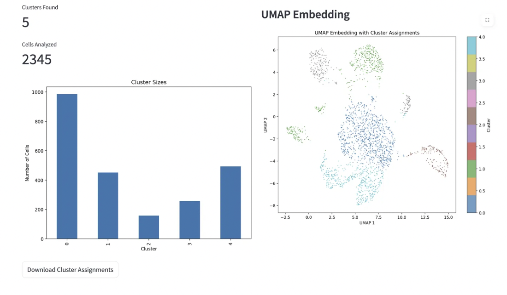

# Interactive Single-Cell Analysis Platform for Unsupervised Clustering and Supervised Labelling

This project implements both **unsupervised clustering** and **supervised labeling** of single-cell RNA sequencing data. It leverages **highly variable gene selection (HVG), PCA for dimensionality reduction, UMAP embeddings, K-Means clustering, and Random Forest classification** to analyze single-cell transcriptomic datasets.

## Components
* **Unsupervised clustering** using PCA, UMAP, and K-Means.
* **Supervised classification** using Random Forest trained on labeled data.
* **Interactive web interface** with the following capabilities:
  - Real-time parameter tuning with sliders and instant feedback
  - Automatic file format detection (H5AD, CSV, TSV, H5, Excel, MTX, Loom)
  - Interactive UMAP visualizations with matplotlib
  - Automatic cell type column detection for supervised mode
  - Downloadable results (cluster assignments and predictions)
  - Quality control metrics and data validation
  - Publication-ready plots and visualizations
* **Efficient preprocessing pipeline** that normalizes, log-transforms, and selects highly variable genes.
* **Scalable and modular implementation** using Python and Scanpy.

### UMAP Clustering Results


### Cell Type Classification


## Files
* `best_cleaned.py` - Main script for both clustering and classification.
* `streamlit_app.py` - Interactive web interface for analysis and visualization.
* `data_exp.py` - Exploratory data analysis script.
* `clusters.npy` - Output file containing the predicted cluster labels.
* `requirements.txt` - List of required Python dependencies.

## Usage

### Command Line Interface
```bash
python3 best_cleaned.py -t mouse_spatial_brain_section0.h5ad -d mouse_spatial_brain_section1_modified.h5ad -o clusters.npy # supervised labeling
```

### Interactive Web Interface
```bash
streamlit run streamlit_app.py
```

The pipeline was evaluated using Adjusted Mutual Information (AMI) scores & ended up scoring the highest in [class](https://bits.csb.pitt.edu/cobb2060/assign3/) , while also beating the previous cohort's best score (nickname: oceanman🙂)

**Acknowledgments:** This project was completed as part of the MSCBIO2066 Machine Learning for Biomedical Applications coursework at the University of Pittsburgh.

**Dataset source:** https://bits.csb.pitt.edu/mscbio2066/assign3/data/
